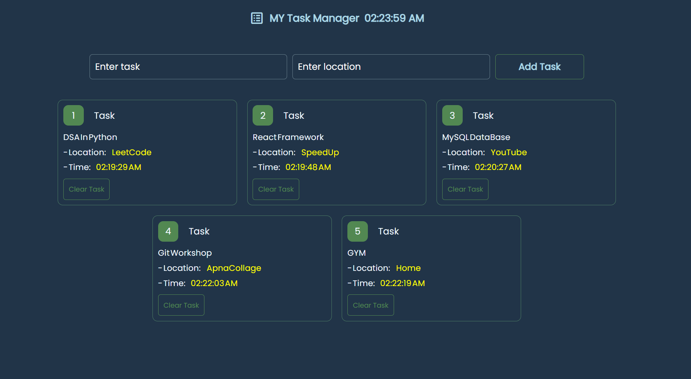

# 📝 MY Task Manager

A simple and visually appealing **Task Manager Web App** built with **HTML, CSS, and JavaScript**.  
It allows you to add tasks with a location, display them in a styled card layout, and view the exact time the task was created.

---

## 📸 Screenshot



---

## ✨ Features

- **Add Tasks**: Enter task name and location, then add to the list.
- **Time Tracking**: Each task records the exact creation time in **HH:MM:SS AM/PM** format.
- **Card Layout**: Tasks are displayed as clean, numbered cards.
- **Clear Task Button** *(placeholder)*: Each task includes a "Clear Task" button for future removal functionality.
- **Real-time Clock**: The header shows the current time in **HH:MM:SS AM/PM** format.

---

## 🛠️ Technologies Used

- **HTML5** – Structure and layout.
- **CSS3** – Styling and responsive design.
- **JavaScript (Vanilla)** – Dynamic task handling and time display.

---

## 🚀 How to Run Locally

1. **Clone the Repository**  
   ```bash
   git clone https://github.com/your-username/my-task-manager.git
